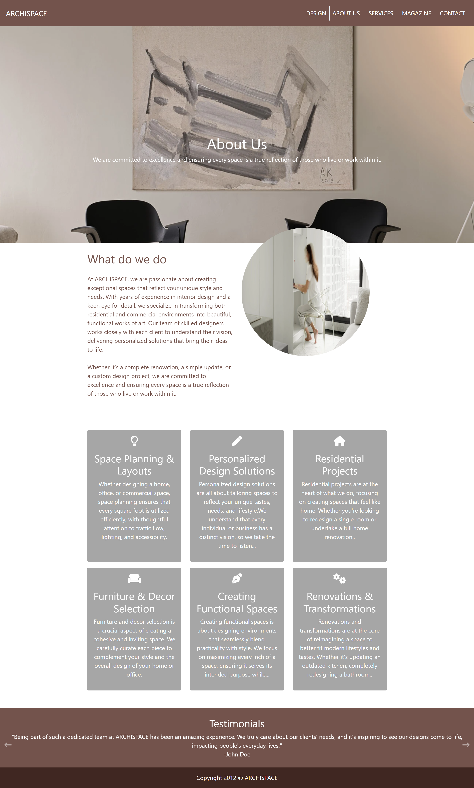
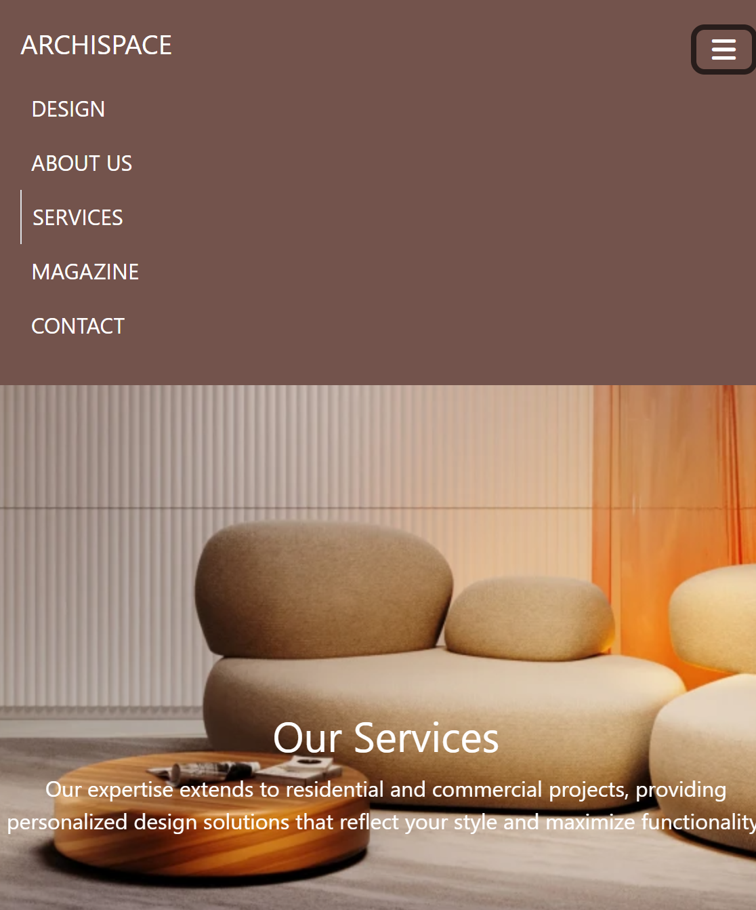

# Archispace_Bootstrap_MartinaMilosheva

 
 
 
 

This website is also deployed on Netlify and you can check it [HERE](https://archispace.netlify.app/).

## Table of Contents 
1. [Instructions of running the project](#run)
2. [Technologies used](#technologies)
3. [Brief](#brief)

## Run
To get started with this project, follow these steps:
1. Clone the repository in the program that you use for writing code.
2. Open the index.html with your favourite browser.

## Technologies used in this project 
HTML, CSS, Bootstrap 5 and GIT.

## Brief
This project is a responsive website designed for an architecture and interior design company, created to showcase my proficiency in Bootstrap 5 and demonstrate the practical application of the skills I acquired during my academy classes. The primary objective was to test and enhance my understanding of responsive web design, layout management, and the integration of various Bootstrap components.
The website includes sections such as a homepage, about us, services, magazine, and contact form, all crafted using Bootstrap’s grid system, components, and utilities. It features a modern and clean design, with an emphasis on visual appeal, ease of navigation, and adaptability across devices. The project aimed to review key concepts like containerization, flexbox layout, card components, navigation bars, and responsive design techniques, ensuring the site is fully functional on both desktop and mobile screens.

This project not only helped refine my Bootstrap skills but also reinforced best practices for building clean, maintainable, and user-friendly websites.
